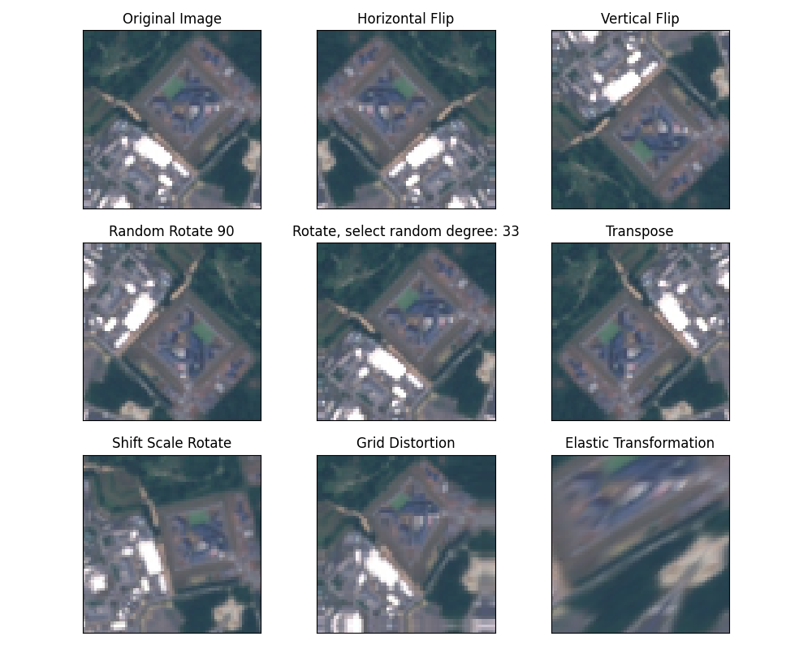
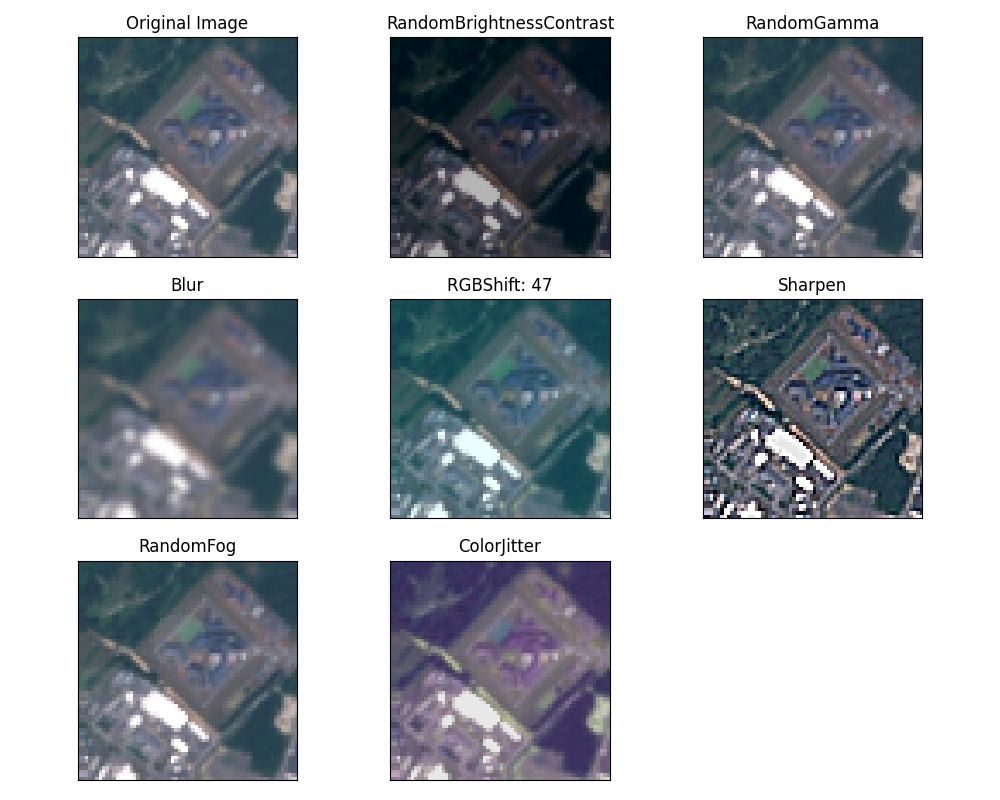
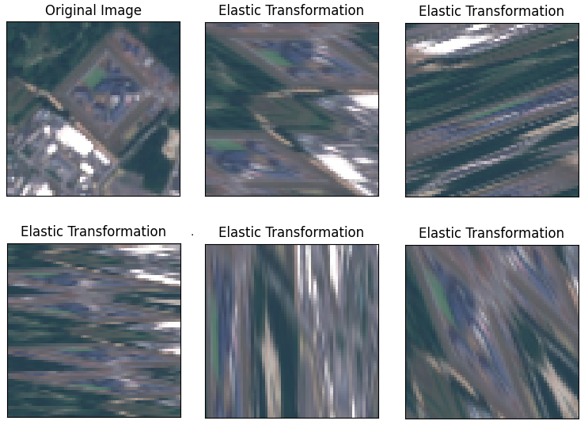

# Exploring the EuroSAT dataset with PyTorch and image augmentation techniques

The project's goal is to explore the [EuroSAT](https://arxiv.org/pdf/1709.00029.pdf) (RGB) dataset by applying different pre-trained models (VGG, ResNet, EfficientNet) and compare the accuracy of these models. At first, I did not implement any data augmentation techniques except normalization. I trained each model for 100 epochs with Adam Optimization. I learned:

* The architecture of these algorithms
* How to update the last layer of the pre-trained model (I need 10 classes)
* How to implement learning rate decay
* Data augmentation 
* Other ...... 
## Accuracy
| Model |  Number of epochs  | Training set accuracy (18900) | Validation set accuracy (5400) | Test set accuracy (2700) |
| ----------------- | ----------- | ----------------- | ----------- | ----------- |
| [VGG11](https://arxiv.org/pdf/1409.1556.pdf)        | 100 |[100%](output/png/EuroSAT_VGG11.png)            |[97.50% ](output/png/EuroSAT_VGG11.png) | 98.14%  |
| [VGG19](https://arxiv.org/pdf/1409.1556.pdf)        | 100 |[100%](output/png/EuroSAT_VGG19.png)            |[97.59%](output/png/EuroSAT_VGG19.png)  |  98.25% |
| [ResNet18](https://arxiv.org/pdf/1512.03385.pdf)    | 100 |[99.75%](output/png/EuroSAT_RESNET18.png)       |[96.41%](output/png/EuroSAT_RESNET18.png)   |  96.40% |
| [ResNet152](https://arxiv.org/pdf/1512.03385.pdf)   | 100 |[100%](output/png/EuroSAT_RESNET152.png)        |[97.61%](output/png/EuroSAT_RESNET152.png)  |  97.81% |
| [EfficientNet-B1](https://arxiv.org/abs/1512.03385) | 100 |[99.96%](output/png/EuroSAT_EFFICIENTNET-B1.png)|[97.41%](output/png/EuroSAT_EFFICIENTNET-B1.png) | 98.11%  |
| [EfficientNet-B7](https://arxiv.org/abs/1512.03385) | 100 |[99.97%](output/png/EuroSAT_EFFICIENTNET-B7.png)|[97.00%](output/png/EuroSAT_EFFICIENTNET-B7.png) | 98.22%  |

### From the table, we can see that the models are *overfitting*, where 3 models with 100% accuracy on the training set. In general, I got good results with 98.25% accuracy on the testing set. To prevent overfitting, I  performed data augmentation techniques. 
##  Image augmentation (using [Albumentations](https://arxiv.org/pdf/1809.06839.pdf))

In the experiment, I divided image augmentation techniques into two parts: the first, related to geometrical or topological transformation of the image, the second, related to color (contrast, brightness, noise) the image. Each transformation was applied with a probability of 25%.

## Geometrical or topological transformation

### Accuracy after applying geometrical or topological transformation
| Model |  Number of epochs  | Training set accuracy (18900) | Validation set accuracy (5400) | Test set accuracy (2700) |
| ----------------- | ----------- | ----------------- | ----------- | ----------- |
| [VGG11](https://arxiv.org/pdf/1409.1556.pdf)        | 100 |[97.79%](output/png/EuroSAT_VGG11_GT.png)          |[98.61% ](output/png/EuroSAT_VGG11_GT.png)         |98.96%|
| [VGG19](https://arxiv.org/pdf/1409.1556.pdf)        | 100 |[98.36%](output/png/EuroSAT_VGG19_GT.png)          |[98.59%](output/png/EuroSAT_VGG19_GT.png)          |98.77%|
| [ResNet18](https://arxiv.org/pdf/1512.03385.pdf)    | 100 |[98.08%](output/png/EuroSAT_RESNET18_GT.png)       |[98.51%](output/png/EuroSAT_RESNET18_GT.png)       |98.59%|
| [ResNet152](https://arxiv.org/pdf/1512.03385.pdf)   | 100 |[98.65%](output/png/EuroSAT_RESNET152_GT.png)      |[98.83%](output/png/EuroSAT_RESNET152_GT.png)      |98.85%|
| [EfficientNet-B1](https://arxiv.org/abs/1512.03385) | 100 |[98.64%](output/png/EuroSAT_EFFICIENTNET-B1_GT.png)|[98.92%](output/png/EuroSAT_EFFICIENTNET-B1_GT.png)|99.14%|
| [EfficientNet-B7](https://arxiv.org/abs/1512.03385) | 100 |[98.94%](output/png/EuroSAT_EFFICIENTNET-B7_GT.png)|[98.85%](output/png/EuroSAT_EFFICIENTNET-B7_GT.png)|98.96%|

## Color transformation

### Accuracy after applying color transformation

| Model |  Number of epochs  | Training set accuracy (18900) | Validation set accuracy (5400) | Test set accuracy (2700) |
| ----------------- | ----------- | ----------------- | ----------- | ----------- |
| [VGG11](https://arxiv.org/pdf/1409.1556.pdf)        | 100 |[99.68%](output/png/EuroSAT_VGG11_C.png)          |[97.31%](output/png/EuroSAT_VGG11_C.png)          |97.81%|
| [VGG19](https://arxiv.org/pdf/1409.1556.pdf)        | 100 |[99.58%](output/png/EuroSAT_VGG19_C.png)          |[97.22%](output/png/EuroSAT_VGG19_C.png)          |98.07%|
| [ResNet18](https://arxiv.org/pdf/1512.03385.pdf)    | 100 |[99.69%](output/png/EuroSAT_RESNET18_C.png)       |[96.20%](output/png/EuroSAT_RESNET18_C.png)       |96.92%|
| [ResNet152](https://arxiv.org/pdf/1512.03385.pdf)   | 100 |[99.89%](output/png/EuroSAT_RESNET152_C.png)      |[97.11%](output/png/EuroSAT_RESNET152_C.png)      |98.07%|
| [EfficientNet-B1](https://arxiv.org/abs/1512.03385) | 100 |[99.67%](output/png/EuroSAT_EFFICIENTNET-B1_C.png)|[97.53%](output/png/EuroSAT_EFFICIENTNET-B1_C.png)|98.11%|
| [EfficientNet-B7](https://arxiv.org/abs/1512.03385) | 100 |[99.88%](output/png/EuroSAT_EFFICIENTNET-B7_C.png)|[96.98%](output/png/EuroSAT_EFFICIENTNET-B7_C.png)|97.85%|

NEXT:
* Perform experiment with all bands 

* The EfficientNet-B1 with Geometrical or topological transformation got 99.14% accuracy with 100 epochs. I wanna see much I can improve the accuracy by combining training and validation data and increasing the number of epochs. 

* From [here](output/Geometrical_Topologocal_Transformation.png)  we can see that geometric transformation is mostly about flipping rotating the original image. Since I am interested in Topological Data Analysis, I wanna focus on Topological distortions. *Grid Distortion* and *Elastic Transformation*.  In other words, I wanna redo the experiment only with these distortions. 
Also, I noticed that sometimes Elastic Transformation drastically changes the original image, which worth exploring how drastic changes affect the accuracy.
  

CREDIT: 
To do this project I was inspired by [Aladdin Persson](https://github.com/aladdinpersson/Machine-Learning-Collection)

