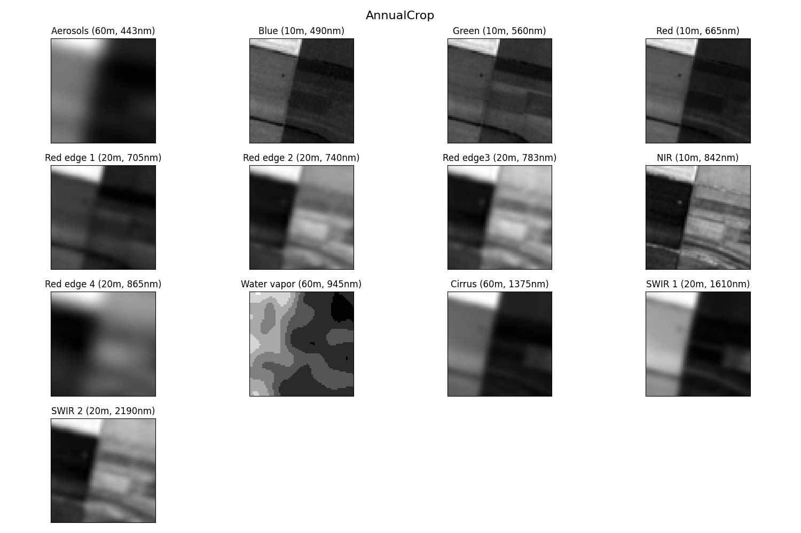

# EuroSAT (Sentinel-2 satellite) with all 13 spectral bands with PyTorch and image augmentation techniques

This is a second part of the project exploring [EuroSAT](https://arxiv.org/pdf/1709.00029.pdf) (13 spectral bands) 
dataset by applying different pre-trained models. 

#### The dataset has 13 spectral bands. First lets visualize them: 

## Industrial

## AnnualCrop

## Sea Lake

After experimenting on the first part I had several questions:
* How the accuracy will change if I use all bands?
* If I increase the number of epochs can I get higher accuracy while using image augmentation techniques?

Also, in comparison with the first part, I removed Elastic_Transformation, and I did not perform normalization, but all values were converted into "float".
For that reason I performed several experiments on each model using different image augmentation techniques:

For that reason I performed several experiments on each model using different image augmentation techniques:
* EuroSAT Dataset with 13 spectral bands: no image augmentation techniques
* EuroSAT Dataset with 13 spectral bands: image augmentation techniques with only color transformation
* EuroSAT Dataset with 13 spectral bands: image augmentation techniques with only geometrical and topological transformations
* EuroSAT Dataset with 13 spectral bands: image augmentation techniques with color, geometrical and topological transformations

## Accuracy of EuroSAT Dataset with 13 spectral bands: no image augmentation techniques
| Model |  Number of epochs  | Training set accuracy (18900) | Validation set accuracy (5400) | Test set accuracy (2700) |
| ----------------- | ----------- | ----------------- | ----------- | ----------- |
| [VGG11](https://arxiv.org/pdf/1409.1556.pdf)        | 300 |[100%](output/png/EuroSATallBands_VGG11_O.png)            |[93.94%](output/png/EuroSATallBands_VGG11_O.png)          |94.45%|
| [VGG19](https://arxiv.org/pdf/1409.1556.pdf)        | 300 |[100%](output/png/EuroSATallBands_VGG19_O.png)            |[94.11%](output/png/EuroSATallBands_VGG19_O.png)          |94.23%|
| [ResNet18](https://arxiv.org/pdf/1512.03385.pdf)    | 300 |[100%](output/png/EuroSATallBands_RESNET18_O.png)         |[94.29%](output/png/EuroSATallBands_RESNET18_O.png)       |94.67%|
| [ResNet152](https://arxiv.org/pdf/1512.03385.pdf)   | 300 |[100%](output/png/EuroSATallBands_RESNET152_O.png)        |[96.24%](output/png/EuroSATallBands_RESNET152_O.png)      |96.30%|
| [EfficientNet-B1](https://arxiv.org/abs/1512.03385) | 300 |[100%](output/png/EuroSATallBands_EFFICIENTNET-B1_O.png)  |[96.91%](output/png/EuroSATallBands_EFFICIENTNET-B1_O.png)|96.84%|
| [EfficientNet-B7](https://arxiv.org/abs/1512.03385) | 300 |[99.99%](output/png/EuroSATallBands_EFFICIENTNET-B7_O.png)|[97.31%](output/png/EuroSATallBands_EFFICIENTNET-B7_O.png)|97.46%|

## Accuracy of EuroSAT Dataset with 13 spectral bands: image augmentation techniques with only color transformation
| Model |  Number of epochs  | Training set accuracy (18900) | Validation set accuracy (5400) | Test set accuracy (2700) |
| ----------------- | ----------- | ----------------- | ----------- | ----------- |
| [VGG11](https://arxiv.org/pdf/1409.1556.pdf)        | 300 |[78.38%](output/png/EuroSATallBands_VGG11_C.png)          |[93.25%](output/png/EuroSATallBands_VGG11_C.png)          |93.94%|
| [VGG19](https://arxiv.org/pdf/1409.1556.pdf)        | 300 |[78.13%](output/png/EuroSATallBands_VGG19_C.png)          |[94.11%](output/png/EuroSATallBands_VGG19_C.png)          |93.44%|
| [ResNet18](https://arxiv.org/pdf/1512.03385.pdf)    | 300 |[77.75%](output/png/EuroSATallBands_RESNET18_C.png)       |[94.85%](output/png/EuroSATallBands_RESNET18_C.png)       |95.32%|
| [ResNet152](https://arxiv.org/pdf/1512.03385.pdf)   | 300 |[78.24%](output/png/EuroSATallBands_RESNET152_C.png)      |[96.03%](output/png/EuroSATallBands_RESNET152_C.png)      |96.33%|
| [EfficientNet-B1](https://arxiv.org/abs/1512.03385) | 300 |[77.30%](output/png/EuroSATallBands_EFFICIENTNET-B1_C.png)|[96.72%](output/png/EuroSATallBands_EFFICIENTNET-B1_C.png)|96.70%|
| [EfficientNet-B7](https://arxiv.org/abs/1512.03385) | 300 |[78.17%](output/png/EuroSATallBands_EFFICIENTNET-B7_C.png)|[97.55%](output/png/EuroSATallBands_EFFICIENTNET-B7_C.png)|97.53%|

## Accuracy of EuroSAT Dataset with 13 spectral bands: image augmentation techniques with only geometrical and topological transformation
| Model |  Number of epochs  | Training set accuracy (18900) | Validation set accuracy (5400) | Test set accuracy (2700) |
| ----------------- | ----------- | ----------------- | ----------- | ----------- |
| [VGG11](https://arxiv.org/pdf/1409.1556.pdf)        | 300 |[99.45%](output/png/EuroSATallBands_VGG11_G.png)          |[96.35%](output/png/EuroSATallBands_VGG11_G.png)   | 96.37%  |
| [VGG19](https://arxiv.org/pdf/1409.1556.pdf)        | 300 |[97.57%](output/png/EuroSATallBands_VGG19_G.png)          |[95.47%](output/png/EuroSATallBands_VGG19_G.png) |  95.03% |
| [ResNet18](https://arxiv.org/pdf/1512.03385.pdf)    | 300 |[99.92%](output/png/EuroSATallBands_RESNET18_G.png)       |[98.09%](output/png/EuroSATallBands_RESNET18_G.png)    |  97.86% |
| [ResNet152](https://arxiv.org/pdf/1512.03385.pdf)   | 300 |[99.95%](output/png/EuroSATallBands_RESNET152_G.png)      |[98.40%](output/png/EuroSATallBands_RESNET152_G.png)  |  98.04% |
| [EfficientNet-B1](https://arxiv.org/abs/1512.03385) | 300 |[99.91%](output/png/EuroSATallBands_EFFICIENTNET-B1_G.png)|[98.58%](output/png/EuroSATallBands_EFFICIENTNET-B1_G.png) | 98.62%  |
| [EfficientNet-B7](https://arxiv.org/abs/1512.03385) | 300 |[99.94%](output/png/EuroSATallBands_EFFICIENTNET-B7_G.png)|[99.03%](output/png/EuroSATallBands_EFFICIENTNET-B7_G.png) | 98.55%  |

## Accuracy of EuroSAT Dataset with 13 spectral bands: image augmentation techniques with color, geometrical and topological transformations
| Model |  Number of epochs  | Training set accuracy (18900) | Validation set accuracy (5400) | Test set accuracy (2700) |
| ----------------- | ----------- | ----------------- | ----------- | ----------- |
| [VGG11](https://arxiv.org/pdf/1409.1556.pdf)        | 300 |[74.70%](output/png/EuroSATallBands_VGG11_GC.png)          |[94.94%](output/png/EuroSATallBands_VGG11_GC.png)   | 95.10%  |
| [VGG19](https://arxiv.org/pdf/1409.1556.pdf)        | 300 |[74.48%](output/png/EuroSATallBands_VGG19_GC.png)          |[94.90%](output/png/EuroSATallBands_VGG19_GC.png)    |  95.17% |
| [ResNet18](https://arxiv.org/pdf/1512.03385.pdf)    | 300 |[76.75%](output/png/EuroSATallBands_RESNET18_GC.png)       |[97.22%](output/png/EuroSATallBands_RESNET18_GC.png)  |  97.68% |
| [ResNet152](https://arxiv.org/pdf/1512.03385.pdf)   | 300 |[77.51%](output/png/EuroSATallBands_RESNET152_GC.png)      |[98.36%](output/png/EuroSATallBands_RESNET152_GC.png) |  98.15% |
| [EfficientNet-B1](https://arxiv.org/abs/1512.03385) | 300 |[76.50%](output/png/EuroSATallBands_EFFICIENTNET-B1_GC.png)|[98.31%](output/png/EuroSATallBands_EFFICIENTNET-B1_GC.png) | 97.82%  |
| [EfficientNet-B7](https://arxiv.org/abs/1512.03385) | 300 |[77.76%](output/png/EuroSATallBands_EFFICIENTNET-B7_GC.png)|[98.69%](output/png/EuroSATallBands_EFFICIENTNET-B7_GC.png) | 98.65%  |

## Summary:
From this experiment, we can see that adding all bands will not increase accuracy. Maybe the reason was normalization, or 
each band has a different resolution, or maybe data in that bands were redundant(red band) or was not useful. 

## NEXT:
* To test the usefulness of other bands, in Part 3, I want to remove RGB from the data and perform the short experiment.
* In all experiments I used [Adam optimizer](https://arxiv.org/pdf/1412.6980.pdf), now I wanna test different optimization techniques.  

