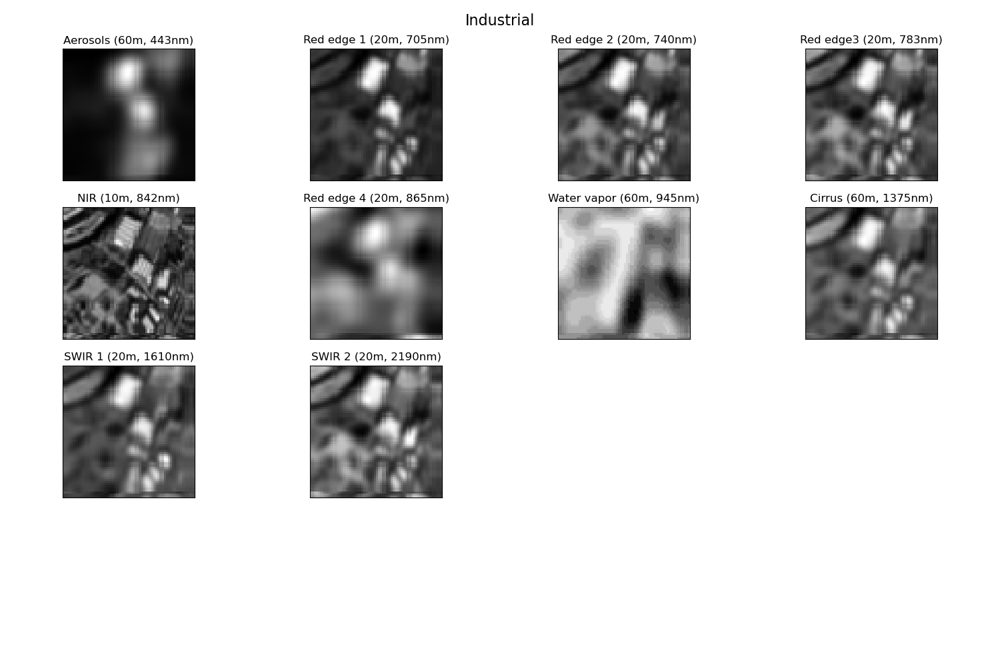
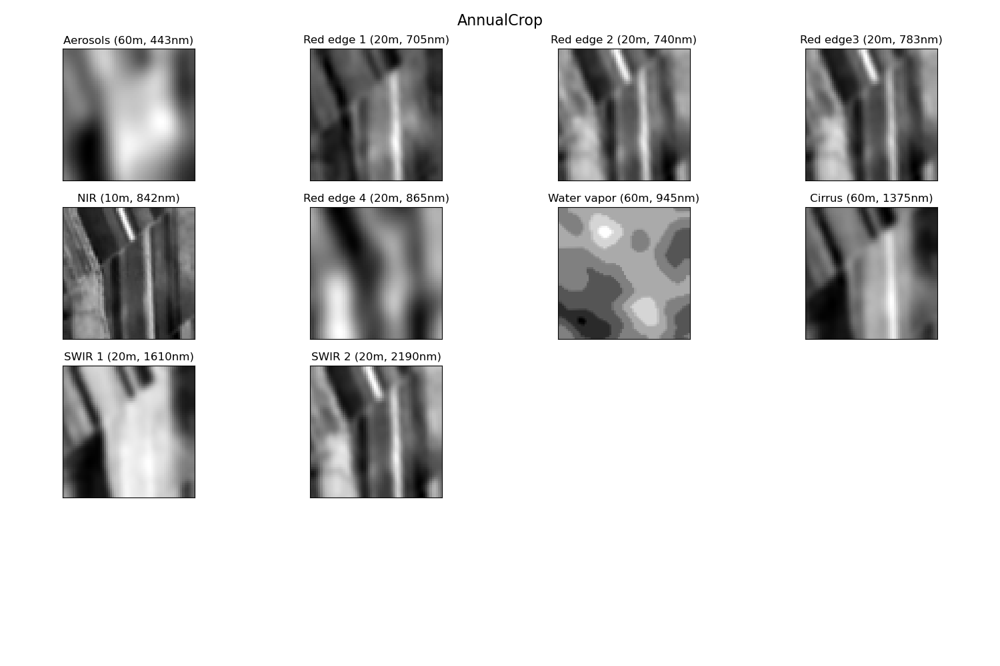
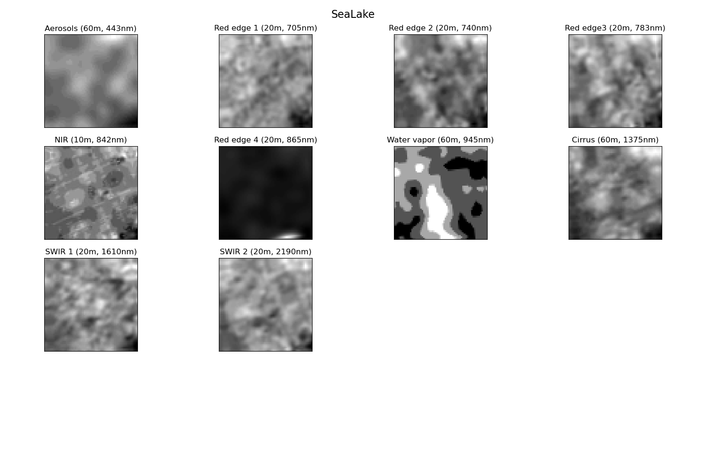

# EuroSAT (Sentinel-2 satellite) with 10 spectral bands (NoRGB) with PyTorch and image augmentation techniques

This is a third part of the project exploring [EuroSAT](https://arxiv.org/pdf/1709.00029.pdf) (10 spectral bands without RGB) 
dataset by applying different pre-trained models. 

#### The dataset has 10 spectral bands. First lets visualize them: 

## Industrial

## AnnualCrop

## Sea Lake

After experimenting on the second part my main question was:
* How valuable other bands are ?

For that reason I performed several experiments. This experimetns Identical to the second part the only difference is I removed RGB:
* EuroSAT Dataset with 10 spectral bands: no image augmentation techniques
* EuroSAT Dataset with 10 spectral bands: image augmentation techniques with color, geometrical and topological transformations

## Accuracy of EuroSAT Dataset with 13 spectral bands: no image augmentation techniques
| Model |  Number of epochs  | Training set accuracy (18900) | Validation set accuracy (5400) | Test set accuracy (2700) |
| ----------------- | ----------- | ----------------- | ----------- | ----------- |
| [VGG11](https://arxiv.org/pdf/1409.1556.pdf)        | 300 |[96.09%](output/png/EuroSATallBands_VGG11_O.png)            |[93.20%](output/png/EuroSATallBands_VGG11_O.png)          |93.22%|
| [VGG19](https://arxiv.org/pdf/1409.1556.pdf)        | 300 |[92.12%](output/png/EuroSATallBands_VGG19_O.png)            |[89.63%](output/png/EuroSATallBands_VGG19_O.png)          |89.74%|
| [ResNet18](https://arxiv.org/pdf/1512.03385.pdf)    | 300 |[100%](output/png/EuroSATallBands_RESNET18_O.png)         |[93.02%](output/png/EuroSATallBands_RESNET18_O.png)       |93.47%|
| [ResNet152](https://arxiv.org/pdf/1512.03385.pdf)   | 300 |[100%](output/png/EuroSATallBands_RESNET152_O.png)        |[96.35%](output/png/EuroSATallBands_RESNET152_O.png)      |96.41%|
| [EfficientNet-B1](https://arxiv.org/abs/1512.03385) | 300 |[99.99%](output/png/EuroSATallBands_EFFICIENTNET-B1_O.png)  |[95.97%](output/png/EuroSATallBands_EFFICIENTNET-B1_O.png)|96.12%|
| [EfficientNet-B7](https://arxiv.org/abs/1512.03385) | 300 |[99.99%](output/png/EuroSATallBands_EFFICIENTNET-B7_O.png)|[96.23%](output/png/EuroSATallBands_EFFICIENTNET-B7_O.png)|96.66%|

## Accuracy of EuroSAT Dataset with 13 spectral bands: image augmentation techniques with color, geometrical and topological transformations
| Model |  Number of epochs  | Training set accuracy (18900) | Validation set accuracy (5400) | Test set accuracy (2700) |
| ----------------- | ----------- | ----------------- | ----------- | ----------- |
| [VGG11](https://arxiv.org/pdf/1409.1556.pdf)        | 300 |[66.73%](output/png/EuroSATallBands_VGG11_GC.png)          |[88.11%](output/png/EuroSATallBands_VGG11_GC.png)   | 88.94%  |
| [VGG19](https://arxiv.org/pdf/1409.1556.pdf)        | 300 |[67.33%](output/png/EuroSATallBands_VGG19_GC.png)          |[88.72%](output/png/EuroSATallBands_VGG19_GC.png)    |  89.52% |
| [ResNet18](https://arxiv.org/pdf/1512.03385.pdf)    | 300 |[77.64%](output/png/EuroSATallBands_RESNET18_GC.png)       |[97.04%](output/png/EuroSATallBands_RESNET18_GC.png)  |  97.06% |
| [ResNet152](https://arxiv.org/pdf/1512.03385.pdf)   | 300 |[77.75%](output/png/EuroSATallBands_RESNET152_GC.png)      |[97.73%](output/png/EuroSATallBands_RESNET152_GC.png) |  97.78% |
| [EfficientNet-B1](https://arxiv.org/abs/1512.03385) | 300 |[77.44%](output/png/EuroSATallBands_EFFICIENTNET-B1_GC.png)|[98.20%](output/png/EuroSATallBands_EFFICIENTNET-B1_GC.png) | 98.04%  |
| [EfficientNet-B7](https://arxiv.org/abs/1512.03385) | 300 |[77.47%](output/png/EuroSATallBands_EFFICIENTNET-B7_GC.png)|[98.38%](output/png/EuroSATallBands_EFFICIENTNET-B7_GC.png) | 98.47%  |

## Summary:
From this experiment, I expected that if we remove RGB the accuracy will dramatically drop. However, we can see that in general, the accuracy did not change. For some cases (Resnet152)
the accuracy was a little bit higher. This result can indicate that NoRGB bands may contain some valuable information.

## NEXT:
* Experiment with different pixel resolutions. The current size of the dataset is 64 * 64 pixels. What if I rescale them and make 128 * 128 or 256 * 256 pixels? Can I get different results? 
* In all experiments I used [Adam optimizer](https://arxiv.org/pdf/1412.6980.pdf), now I wanna test different optimization techniques.  
* Later I wanna add addtional features: NDVI, Topology, and 
* Later I wanna add additional features such as NDVI  Topology

