# SpaceNet Challenge 1: Building Detection Using Semantic Segmentation Technique and Unet Model

The project's goal is to perform semantic segmentation technique on [SpaceNet 1 (Rio)](https://spacenet.ai/spacenet-buildings-dataset-v1/) dataset
to perform building detection task. This is the first step and here I learned:

* The architecture of the Unet algorithm
* How to preprocess geospatial data for semantic segmentation task using [solaris](https://solaris.readthedocs.io/en/latest/index.html) tools:
  * How to divide large satellite images and labels into small tiles 
  * Prepare and save Mask (here I saved Masks as .npy files)
* Data augmentation
* Other ...... 

## Accuracy
So far I got around 97% accuracy (I think it is not the correct way to measure semantic segmentation accuracy)
Here are some results: 

|  Mask  | Detected Building Footprints|
|  ------------------ | ----------------- | 
| 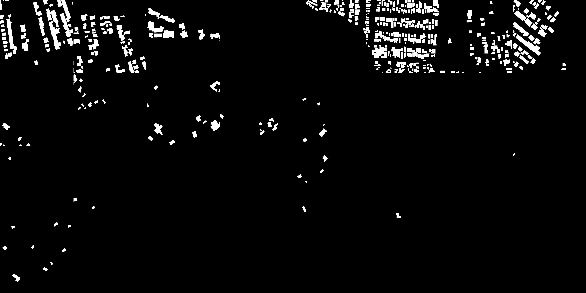 |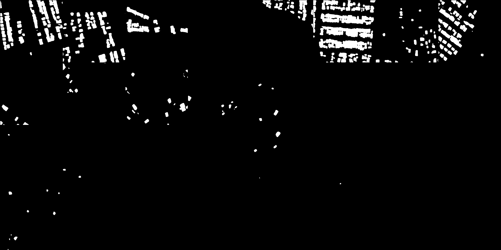 |
| 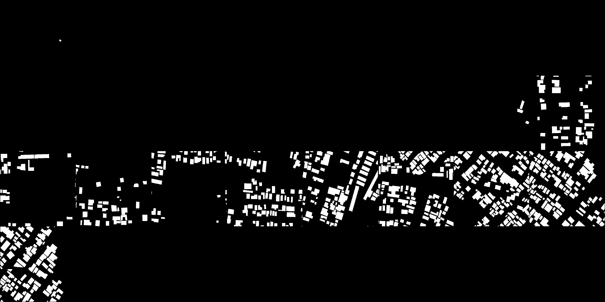 |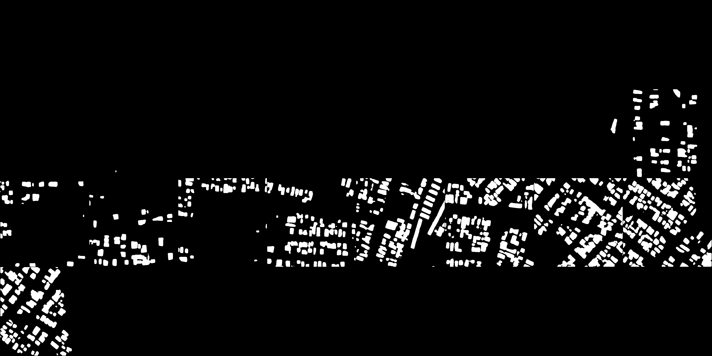 |
| 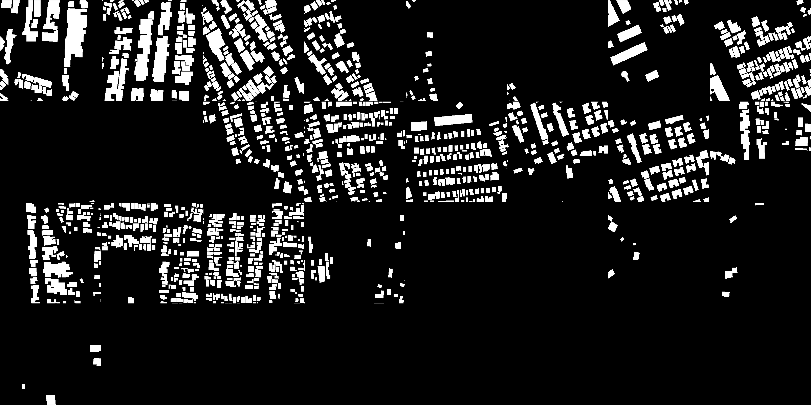 |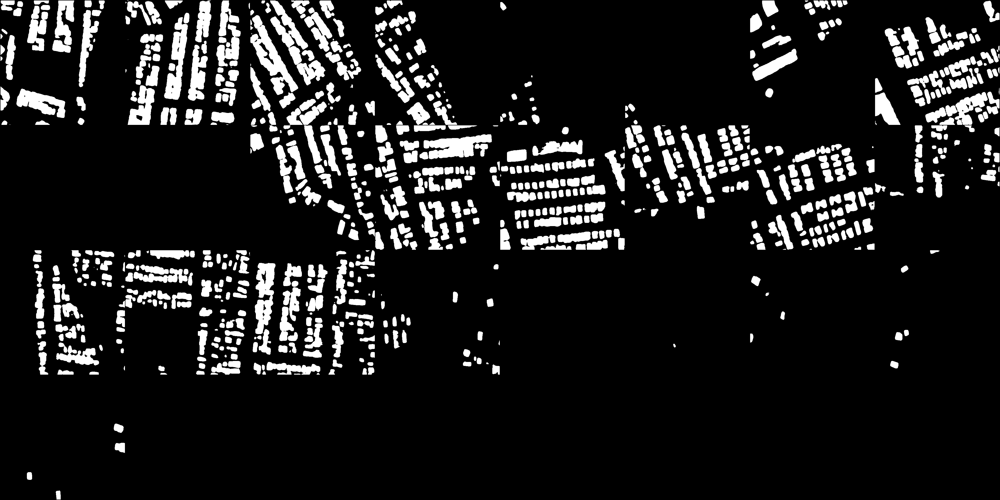 |
| 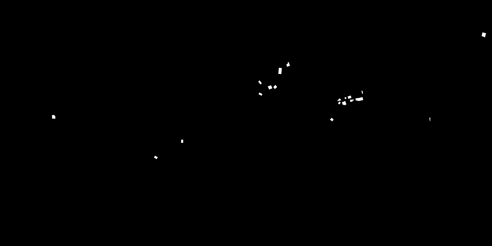 |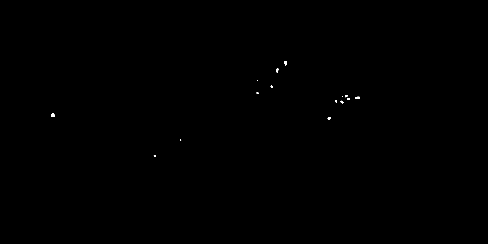 |
| 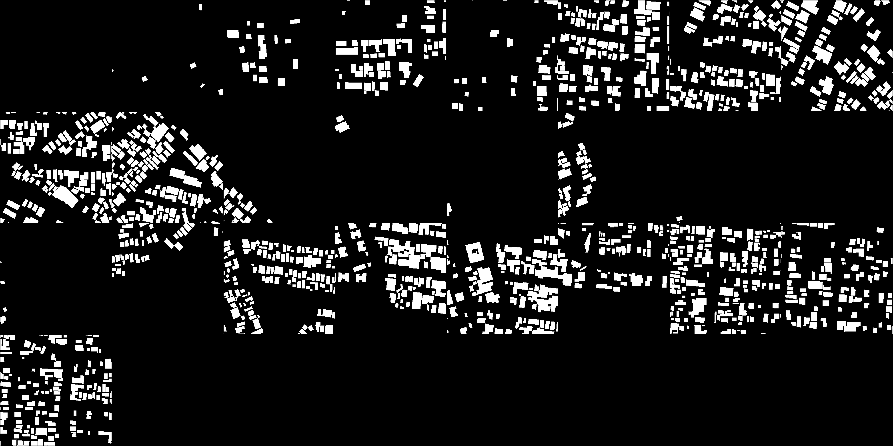 |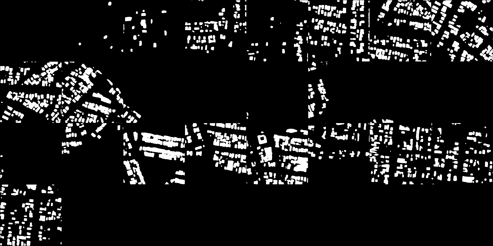 |
| 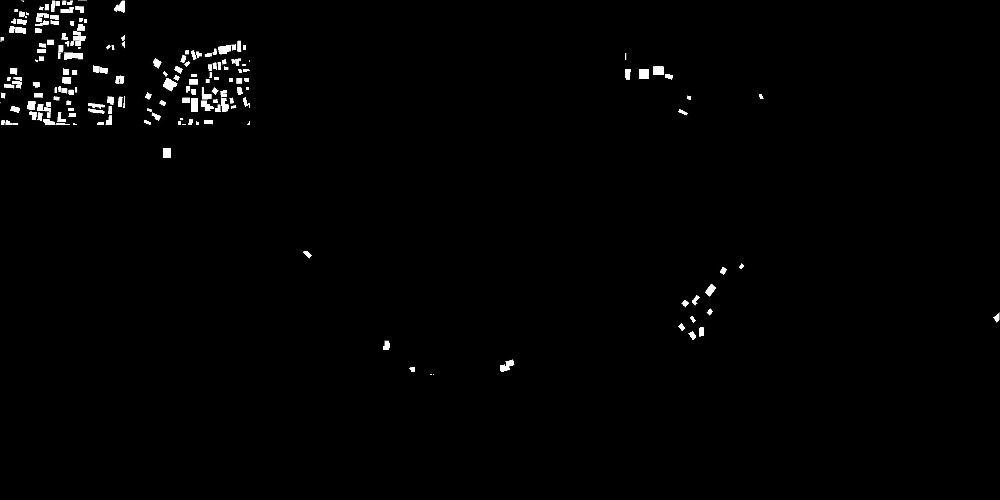 |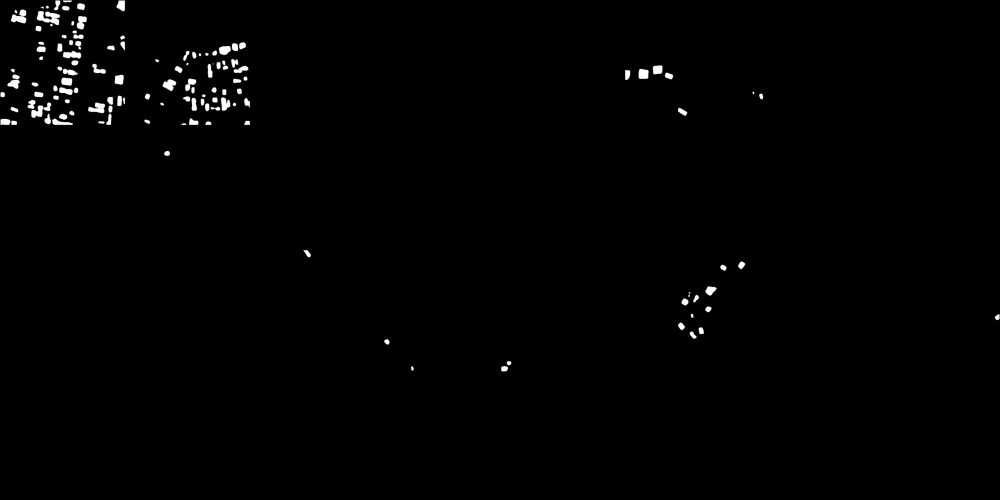 |
| 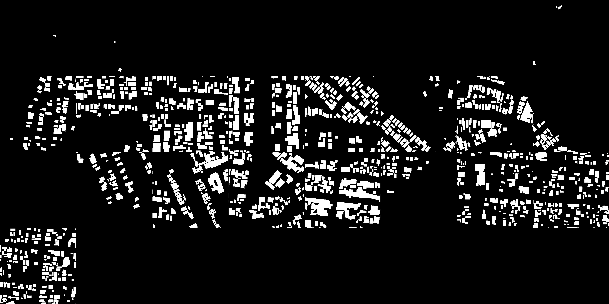 |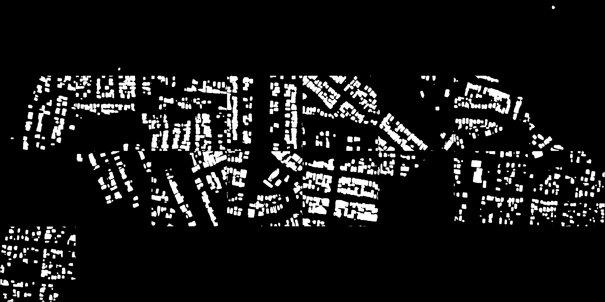 |
| 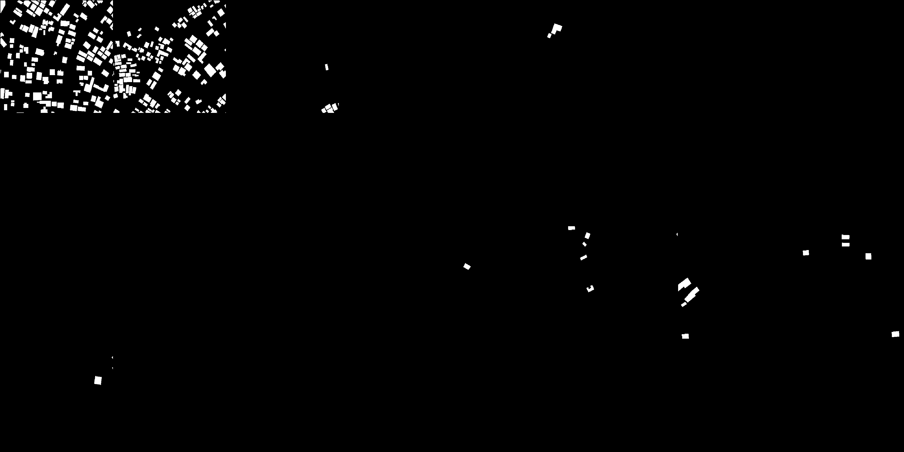 |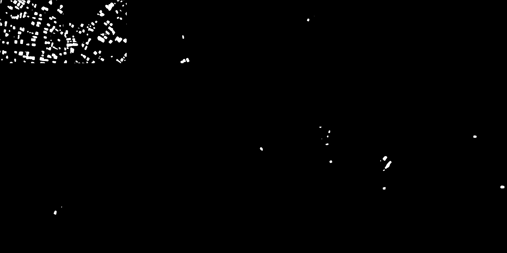 |

(For more results check saved_images folder)

NEXT:
* Function to store results in each test 
* Study how accuracy is measured in this task (Cohen's kappa,intersection over union)
* Perform experiment by adding more data 
* Perform experiment by using more data augmentation techniques
* Use and compare with other models

